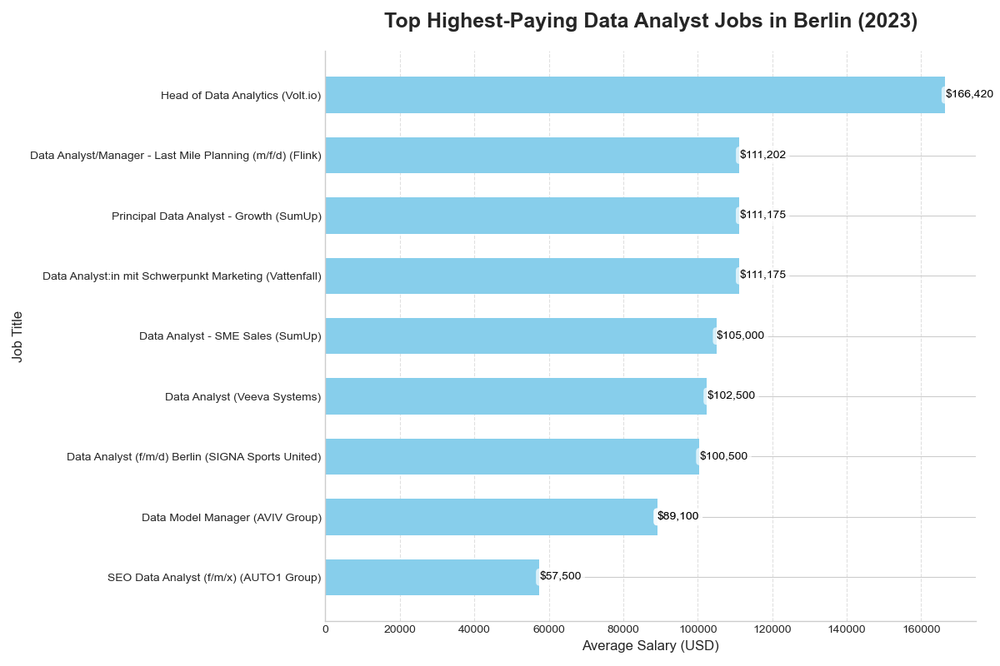
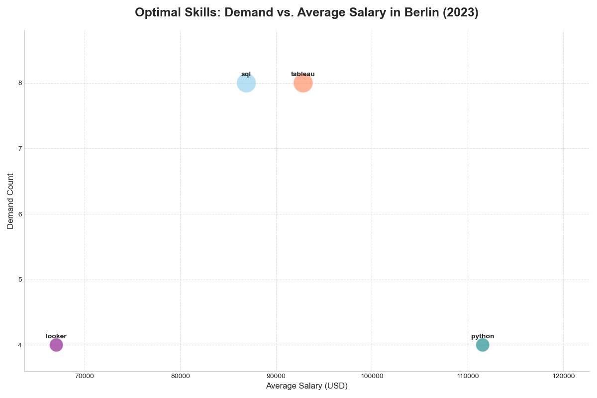

SQL Project - Job Analysis

# Introduction
Dive into the data job market! Focusing on data analyst roles in Berlin, Germany, in 2023, this project explores top-paying jobs, in-demand skills, and where high demand meets high salary in data analytics.

SQL queries? Check them out here: [project_sql folder](/project_sql/)

#  Background
Driven by a quest to navigate the data analyst job market more effectively, this project was created to identify top-paying and in-demand skills, making it easier for others to find the best job opportunities.

Data hails from this [SQL Course](https://lukebarousse.com/sql). It includes valuable insights on job titles, salaries, locations, and required skills.

### The questions I wanted to answer through my SQL queries were:

1. What are the top-paying data analyst jobs in Berlin, Germany?
2. What skills are required for these top-paying jobs?
3. What skills are most in demand for data analysts?
4. Which skills are associated with higher salaries?
5. What are the most optimal skills to learn (high demand/high salary)?

# Tools I Used
For my deep dive into the data analyst job market, I used several key tools:

- **SQL:** The backbone of my analysis, enabling me to query the database and uncover insights.

- **PostgreSQL:** The database management system I used to handle job posting data.

- **Python:** Used for creating visualizations from CSV outputs.

    - **pandas** – To read CSV files for plotting.

    - **matplotlib** – For creating clear and informative charts.

    - **os** – For handling file paths when saving charts.

- **Visual Studio Code:** My primary tool for writing and executing SQL queries.

- **Git & GitHub:** Essential for version control and sharing my SQL scripts and analysis, ensuring collaboration and project tracking.

# The Analysis
Each query in this project focused on exploring different aspects of the data analyst job market.
Here’s how I approached each question:

### 1. Top-paying Data Analyst jobs in Berlin, Germany
**Query:** [1_top_paying_jobs.sql](/project_sql/1_top_paying_jobs.sql)

I filtered the dataset to include only Data Analyst roles in Berlin with non-null salaries. Ordering by average yearly salary revealed the top 10 highest-paying opportunities.

The highest salary reached **$166,420**, offered by Volt.io for a Head of Data Analytics role.

Other top-paying companies included **Flink, SumUp, Vattenfall, and Veeva Systems**, with salaries ranging from €100,500 to €111,202.

Interestingly, titles varied from Data Analyst to more senior positions like Principal Data Analyst and Data Model Manager, suggesting that higher pay is often tied to specialization or leadership responsibilities.


*A bar chart that visualizes the top 9 highest paying data analyst jobs*

### 2. Skills required for the top-paying jobs
**Query:** [2_top_paying_job_skills.sql](project_sql/2_top_paying_job_skills.sql)

To understand what skills these high-paying jobs demand, I joined the top-paying roles with their associated skills.

**SQL** and **Tableau** appeared most frequently (5 mentions each), making them the strongest common denominator for lucrative roles.

**Python** followed closely with 4 mentions, confirming its critical role in data analysis.

Other skills included **R, Power BI, Looker, Git, and AWS**, showing the breadth of technical expertise expected at the upper salary range.

**Insight:** Strong database (SQL), visualization (Tableau), and programming (Python) skills form the core toolkit for high-earning data analysts in Berlin.


*A bar chart that shows the most popular skills associated with the top paying data analyst jobs*

### 3. Most In-Demand Skills for Data Analysts
**Query:** [3_top_demanded_skills.sql](project_sql/3_top_demanded_skills.sql)

By counting skill frequency across all Data Analyst postings, I identified the top 5 in-demand skills.

- **SQL (558 mentions)** is the clear leader, making it the most fundamental requirement.

- **Python (415)** and **Tableau (307)** follow, reaffirming their value.

- **R (192)** and **Excel (173)** also rank highly, showing that statistical and spreadsheet tools remain relevant.

**Insight:** SQL is indispensable, while Python and Tableau are fast becoming industry standards.


*A bar chart that displays the top skills in demand*

### 4. Skills associated with higher salaries
**Query:** [4_top_paying_skills.sql](project_sql/4_top_paying_skills.sql)

I calculated the average salary per skill across job postings with salary data.

- **Power BI** topped the list with an average salary of $166,420, suggesting its strong association with well-paying roles.

- Programming skills like **Python ($111,574)** and **R ($111,189)** followed closely.

- Tools like **MATLAB, Git, Atlassian, and AWS** also showed high salary associations.

- Surprisingly, **SQL ($86,892)** and **Tableau ($92,830)**, while widely required, ranked lower in salary averages — indicating they are baseline skills rather than premium differentiators.

**Insight:** Specialized tools (Power BI, MATLAB, AWS) can boost salaries, while SQL and Tableau remain essential entry requirements.


*A bar chart that illustrates the highest paying skills for data analysts in Berlin (2023)*

### 5. Optimal skills to learn (high dmand + high salary)
**Query:** [5_optimal_skills.sql](project_sql/5_optimal_skills.sql)

Finally, I combined demand and salary data to identify skills offering the best balance of employability and earning potential.

- **Python** emerged as the top optimal skill — high demand plus the highest salary on average.

- **Tableau** and **SQL** followed, reflecting their broad demand and respectable pay levels.

- **Looker** also appeared, offering moderate demand with a decent salary boost.

**Insight:** For aspiring data analysts in Berlin, learning Python, SQL, and Tableau provides both job security and strong salary prospects.


*A scatter plot that represents the relationship between the demand and the average salary for various skills*

# What I learned
Working on this project strengthened both my SQL skills and my ability to analyze job market data.

Some key takeaways include:

- How to **merge tables** using different types of joins and apply CTEs to simplify complex queries.

- The importance of **WHERE clauses** and filtering for **non-null values** to ensure accurate results.

- How to use **GROUP BY** effectively to organize data and apply aggregations such as **COUNT, AVG, ROUND** to measure demand and salary impact across different skills.

- That the most **in-demand skills** (SQL, Python, Tableau) don’t always correspond to the **highest-paying skills** (Power BI, Python, R).

- How to identify **optimal skills** by combining both demand and salary measures, providing a more balanced view of career priorities.


# Conclusions
This project provided a clearer picture of the data analyst job market in Berlin, Germany.
Key conclusions include:

- Top-paying roles often require advanced analytical and business intelligence skills, such as Power BI, Python, and R.

- SQL remains the most demanded skill, underscoring its importance as a core competency for data analysts.

- Python stands out as an optimal skill, being both highly demanded and highly paid.

- Visualization tools like Tableau and Looker also play an important role, offering good demand and solid salary potential.

- For aspiring or current data analysts, focusing on a mix of SQL, Python, and a BI/visualization tool is the best way to maximize both job opportunities and earning potential.

# Setup / Getting Started
Follow these steps to run the project locally:

### 1. Clone the repository
```bash
git clone https://github.com/graziellamorais/sql_berlin_data_analyst_jobs_2023.git
cd sql_berlin_data_analyst_jobs_2023
```

### 2. Set up PostgreSQL
1. Install [PostgreSQL](https://www.postgresql.org/download/).

2. Open your SQL client (e.g., psql or PgAdmin).

3. Run the scripts inside the ```sql_load/``` folder in order:

- ```1_create_database.sql``` → creates the database.

- ```2_create_tables.sql``` → creates the necessary tables.

- ```3_modify_tables.sql``` → applies adjustments to the schema.

### 3. Load the data
- Import the **raw CSV files** into PostgreSQL:

    - ```company_dim.csv```

    - ```job_postings_fact.csv```

    - ```skills_dim.csv```

    - ```skills_job_dim.csv```

These files are the base tables for the analysis.

### 4. Run the SQL analysis
- Navigate to the ```project_sql/``` folder.

- Each file corresponds to one part of the analysis:

    -  ```1_top_paying_jobs.sql```

    - ```2_top_paying_job_skills.sql```

    - ```3_top_demanded_skills.sql```

    - ```4_top_paying_skills.sql```

    - ```5_optimal_skills.sql```

- Running these queries will generate insights and export CSV results into the ```csv_files/``` folder.

### 5. Generate visualizations (optional)
After running the SQL queries in ```project_sql/```, save the result CSVs (e.g., ```1_top_paying_jobs.csv```, ```3_top_demanded_skills.csv```) in ```csv_files/```.

To reproduce the graphs, make sure you have **Python 3.12.4** installed and then install the required libraries:

```bash
pip install pandas matplotlib
```

Then run the script in ```assets/graphs.py``` to generate the charts from the CSV files. The output images (e.g., ```top_paying_jobs.png```, ```optimal_skills.png```) will be saved in the ```assets/``` folder.